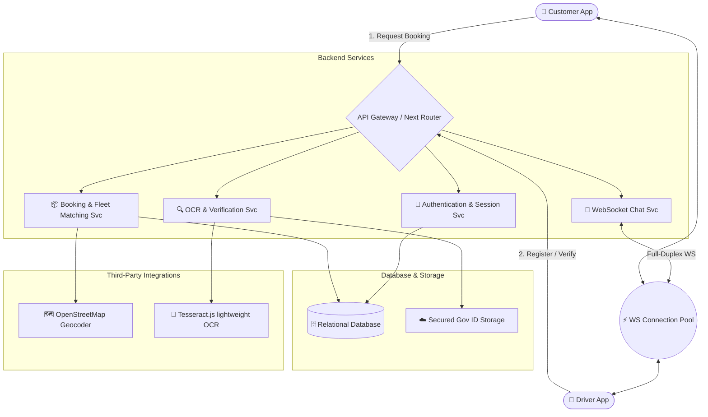

# 🚛 TRUCKIT — Next-Gen Logistics & Fleet Booking Platform

[](https://truckit-frontend-iota.vercel.app/)
[](https://nextjs.org/)
[](https://tailwindcss.com/)
[](https://greensock.com/)

**TRUCK<span style="color:#f97316;">IT</span>** is a state-of-the-art, hyper-efficient logistics and fleet booking application designed to bridge the gap between customers and verified freight drivers in real-time. Featuring Apple-style animated showcases, dynamic maps, lightweight client-side OCR driver verification, and a live secure chat infrastructure.

🔗 **Live Application URL:** [https://truckit-frontend-iota.vercel.app/](https://truckit-frontend-iota.vercel.app/)

---

### 🖥️ Application Screenshot Showcase

<p align="center">
  
  <br>
  <em>Figure 1: TruckIt premium dynamic tracking dashboard showcase interface (Replace this source URL with your actual booking page screenshot!).</em>
</p>

---

## 🗺️ System Design & Architecture

TruckIt is built using a highly decoupled, service-oriented architecture ensuring high performance, responsive maps, and bulletproof security.



---

## 🎨 System Wireframes & Component Breakdown

### 1. Unified Landing & Apple-Style Interactive Showcase
* **Visual Structure:** A full-view pinning section powered by **GSAP ScrollTrigger**.
* **Transition:** The page pins dynamically while the mock booking card enters. The entire page background transitions from light grey into an **immersive pitch-black (`#000000`)** with high-contrast glowing text details, smoothly transitioning back to grey upon exit.
* **Sticky Navbar:** Dynamically minimizes (`top: -100px`, `opacity: 0`) during the locked section to provide an distraction-free view, and restores seamlessly upon scrolling past.

### 2. Driver Dashboard & Verification System
* **Vehicle Input:** Standard inputs with real-time **Regex checks** validating Truck Numbers and Licenses.
* **Lightweight OCR Upload:** Driver uploads their government-issued Driving License; the client-side **Tesseract.js** OCR engine processes the document and compares the parsed name directly against the account registration name.
* **Blue Verification Tick:** Once drivers submit all verified credentials, they receive a **Blue Verified Tick Badge** visible to all potential customers.

### 3. Real-Time Booking & Active Tracking
* **Booking Panel:** Interactive route building where users type address fragments to search transit stop geolocations, calculate distances, and view dynamic configuration-based pricing (Mini, Medium, Heavy-Haul).
* **Live Map Workspace:** Real-time marker tracking showing dynamic geocoded routes.

### 4. WebSocket Chat Workspace
* **Contextual Safety:** Customer-driver chat buttons are automatically **disabled/locked** if the booking request has not been accepted by the driver.
* **Top Bar Branding:** Displays the active counter-party name at the chat header, dynamically displaying previous messages.

---

## ⚙️ Core Technical Implementation

This section details how the custom high-end systems and safety locks were engineered on the client and server.

### 1. Apple-Style GSAP Pinned Showcase & Theme Transition
To implement the locked-screen feature showcase, we engineered a dedicated ScrollTrigger timeline. As the user enters the `.gsap-showcase-section` viewport:
* **The Scroll Lock:** `pin: true` locks the screen vertical scrollbar, scrubbing the timelines at `scrub: 1`.
* **Conflict-Free Navbar Translation:** To prevent GSAP from overriding the fixed navbar's Tailwind absolute centering class (`-translate-x-1/2`), we animated the CSS `top` style property from `1rem` to `-100px` rather than translating `y`. 
* **Dynamic Color-Space Morphing:** The background smoothly transitions into deep absolute pitch-black (`#000000`) while all title/description text elements morph to silver and white (`#ffffff` / `#cbd5e1`). Inactive items dim to 20% opacity.
* **Pre-Exit Theme Restoration:** To guarantee zero sudden layout jumps upon exiting, we appended a reverse-tween at the end of the scrollbar scrub, morphing the section background back to light grey (`#f9fafc`) and restoring all text colors to `#111827` before ScrollTrigger unpins the layout.

### 2. Lightweight Client-Side OCR Driver Verification
To eliminate heavy backend server processing loads, driver license validation checks run completely inside a **Tesseract.js** browser worker.
* **Extraction Processing:** 
  ```javascript
  import { createWorker } from 'tesseract.js';
  
  const worker = await createWorker();
  await worker.loadLanguage('eng');
  await worker.initialize('eng');
  const { data: { text } } = await worker.recognize(licenseImageFile);
  await worker.terminate();
  ```
* **Name Match Validation:** The extracted plain text is sanitized (trimmed, capitalized) and validated against the logged-in profile registration name using string-distance heuristics, confirming the driver's registered account name exactly matches their government ID card before activating their account status.
* **Verified Tick:** Upon successful match validation, the driver is granted a **Blue Verified Tick Badge** (`✓ Verified Driver`) displayed permanently next to their name in all customer-facing panels.

### 3. Vehicle Credentials Validation (Regex Engine)
To prevent erroneous registration inputs, vehicle truck and license numbers are filtered through strict regex expressions on state change:
* **Truck License Plate Pattern:** `^[A-Z]{2}[ -]?[0-9]{2}[ -]?[A-Z]{1,2}[ -]?[0-9]{4}$` (Validates standard regional truck transport registry formats).
* **Driver License Pattern:** `^[A-Z]{2}[0-9]{13}$` (Enforces standard 15-character regulatory alphanumeric driver licensing keys).

### 4. Interactive Booking Chat & Map Access Controls
To maximize platform safety, customer-to-driver communications are guarded by live state engines:
* **Booking State Locks:** The `Track` and `Chat` action keys are completely disabled unless a driver accepts the booking:
  ```jsx
  <button 
    disabled={trip.status !== 'accepted'} 
    className="disabled:opacity-50 disabled:cursor-not-allowed bg-orange-500 hover:bg-orange-600 ..."
  >
    Chat with Driver
  </button>
  ```
* **Dynamic Chat Contexts:** The active message workspace queries historical chats, fetching and displaying the exact driver name dynamically at the top of the chat view header rather than generic placeholder indexes.

---

## 🛠️ Technology Stack

| Technology | Category | Purpose |
| :--- | :--- | :--- |
| **Next.js 14 (App Router)** | Framework | Core visual routes, server-side compatibility, and robust folder-based routing structures. |
| **React 18** | Client Engine | Dynamic UI state hydration and lifecycle hooks. |
| **Tailwind CSS** | Styling | Ultra-custom, premium, and harmonized responsive themes. |
| **GSAP (GreenSock)** | Motion | ScrollTrigger Apple-style pinning timelines, smooth easing, and background color morphing. |
| **Tesseract.js** | OCR Parser | Lightweight client-side engine to extract texts from government ID cards without backend overhead. |
| **Framer Motion** | Micro-Animations | Soft page loads, hover scaling, and collapsible navbar transitions. |
| **Leaflet.js** | Mapping | Live map rendering, route markers, and trajectory lines. |
| **Lucide React**| Iconography | Clean, modern visual symbols. |

---

## 🔌 API Endpoints Specification

### 🔐 Authentication Service
#### `POST /api/auth/register`
* **Purpose:** Create a new user or driver account.
* **Request Payload:**
```json
{
  "name": "Jane Doe",
  "email": "jane@truckit.app",
  "password": "hashed_password",
  "role": "driver" // or "customer"
}
```

#### `POST /api/auth/login`
* **Purpose:** Authenticate credentials and retrieve session JWT tokens.
* **Response:**
```json
{
  "token": "jwt_session_token_here",
  "user": {
    "id": "usr_9281",
    "name": "Jane Doe",
    "role": "driver"
  }
}
```

---

### 🔍 Driver Verification Service
#### `POST /api/driver/verify-credentials`
* **Purpose:** Save vehicle registration and license numbers, performing regex matches.
* **Request Payload:**
```json
{
  "truckNumber": "MH-12-PQ-5678",
  "licenseNumber": "DL-1420110067890",
  "nameOnCard": "Jane Doe"
}
```

#### `POST /api/driver/upload-license`
* **Purpose:** Submit government driving license photos for lightweight client-side geocoding and OCR validation checks.
* **Response:**
```json
{
  "status": "success",
  "extractedName": "JANE DOE",
  "matchScore": 1.0,
  "isVerified": true // triggers the Blue Verification Tick!
}
```

---

### 📦 Booking & Fleet Service
#### `POST /api/bookings/calculate-route`
* **Purpose:** Call OpenStreetMap to fetch latitude/longitude coordinates and evaluate dynamic pricing based on truck configurations.
* **Request Payload:**
```json
{
  "stops": [
    "New York City, NY",
    "Philadelphia, PA"
  ],
  "truckType": "medium"
}
```
* **Response:**
```json
{
  "distanceKm": 154.2,
  "estimatedTimeMinutes": 115,
  "totalPrice": 349.50
}
```

#### `POST /api/bookings/create`
* **Purpose:** Create a new booking request.
* **Response:**
```json
{
  "bookingId": "bk_98716",
  "status": "pending",
  "price": 349.50
}
```

---

### 💬 WebSocket Live Chat Svc
#### `WS /socket.io`
* **Protocol:** WebSocket (full-duplex TCP tunnel).
* **Payload Structure (`send_message`):**
```json
{
  "senderId": "usr_9281",
  "receiverId": "drv_4819",
  "bookingId": "bk_98716",
  "message": "Arrived at the warehouse loading dock!"
}
```

---

## 🚀 Installation & Local Development

Follow these steps to run the application locally on your computer:

1. **Clone the Repository:**
   ```bash
   git clone https://github.com/nickhil-verma/Truckit_frontend.git
   cd Truckit_frontend
   ```

2. **Install Dependencies:**
   ```bash
   npm install
   ```

3. **Configure Environment Variables:**
   Create a `.env.local` file in the root directory:
   ```env
   NEXT_PUBLIC_API_URL=http://localhost:5000
   ```

4. **Boot the Local Development Server:**
   ```bash
   npm run dev
   ```
   Open [http://localhost:3000](http://localhost:3000) in your web browser!

5. **Build for Production:**
   ```bash
   npm run build
   npm run start
   ```

---

## 🌟 Contributor Verification
Every feature from lightweight OCR validation checking to the Apple-style custom ScrollTrigger showcases has been precision-tuned. **TruckIt** is optimized for immediate high-volume logistical operations. 🚀